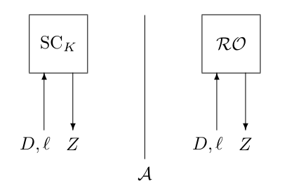

# Distinguishing advantage

We consider adversary Eve to be successful if she finds an attack that has a success probability that is higher than the one in the security claim that comes with the cryptographic primitive. This section is about how we can express such a claim. 

**In a claim, one takes the strongest possible attacker model and if a cryptographic primitive is secure in that model, it is also secure in all weaker attacker models.** 

Random oracle distinguishability is modeled by the following thought experiment:

Behind the back of Eve, we secretly select either $SC_K$ or $RO$. Either function is chosen with 50% possibility: we generate a random bit $b ← − {0, 1}$ , and select SC K if $b = 1$ and $RO$ if $b = 0$. We do not reveal our choice to Eve. However, Eve would like to know this. To measure the success probability that Eve has in guessing b, we consider the experiment the figure. 

In this figure, the adversary, Eve, is in either of two worlds: the “real world” where she speaks with $SC_K$ and the “ideal world” where she speaks with $RO$ ([random oracle](randomoracle.md)). As Eve does not know whether she is in the real or ideal world, we call the entity that is either SC K or RO her “oracle”. Eve can “query” her oracle. In a query she gives as input a diversifier D and requested stream length and her oracle responds with a keystream Z of  bits. In the real world, this keystream satisfies $Z = SC_K(D)$ and in the ideal world it satisfies $Z = RO(D)$. 

Eve can send a number of queries to her oracle, and eventually, she must guess whether she is in the real or in the ideal world. She does so by returning a bit $b' ∈ {0, 1}$. Eve returns 0 if she thinks she is in the real world and 0 if she thinks she is in the ideal world. 

Eve succeeds if $b' = b$ , and we denote this by the event `success`. Clearly, a naive adversary has a success probability of $1/2$ : she may simply make no queries and toss a coin to determine b' . Therefore, her goal would be to succeed in guessing b with probability significantly larger than $1/2$ . In other words, any adversary that succeeds with probability significantly more than $1/2$ can distinguish. 

When considering adversary Eve in a formal way, she (or rather, “it”) is an algorithm. We denote such an adversary by A. We now define the (probability) distance between the real world and the ideal world with respect to an adversary 

$∆_A(SC_K ; RO) = Pr A^{SC_K} = 1) − Pr(A^{RO} = 1)$

In words, this distance is the difference between the probability that the adversary A returns $b'= 1$ in the real world minus the probability that it returns $b' = 1$ in the ideal world. This distance is equal to two times the success probability of the adversary A minus 1:   

$∆_A(SC_K ; RO) = 2Pr (success) − 1$

We call $∆_A(SC_K ; RO)$ **the advantage of A in distinguishing $SC_k$ from $RO$ .** In literature, it is also known as the advantage of A in breaking the pseudorandom function (PRF) security of $SC_K$ .

# Understanding the distinguishing advantage

There is no way to prove an upper bound for $Adv^{prf}_SC(A)$ for any concrete [stream cipher](stream.md), but it makes sense to claim such a bound. Breaking the cipher then simply corresponds with coming up with an algorithm A' with $Adv^prf_SC(A)$ higher than the one [claimed](claim.md).

# Block ciphers and Random Permutation
So far this only talked about [stream ciphers](stream.md) but it works different with [block ciphers](block.md) . A block cipher takes as input a *k*-bit key *K* and *b*-bit plaintext P and [*bijectively*](https://en.wikipedia.org/wiki/Bijection) transforms it to a *b*-bit ciphertext *C*. [(Cryptographic letters)](letters.md) . This makes the situation different from before, where the function was compared with a random oracle that has collisions and variable-length outputs. 

We chance the random oracle with a pseudorandom permutation function. In the new thought experiment we compare the block cipher $B_K$ with a random permutation $P$ . $P$ is like a $RO$ but the difference is that it is for $b-bit$ length inputs and outputs only, and that it never responds with the same value to two different values. Alternatively, one may consider P to be uniformly randomly drawn from the set of all b-bit permutations. 

## Distinguishing Advantage 
The distinguishing advantage remains mainly unchanged. It now looks like this:

$∆_A(B_K ; R) = Pr A^{B_K} = 1) − Pr(A^{P} = 1)$ \ 

In literature, it is also known as the advantage of $A$ in breaking the [pseudorandom permutation (PRP)](prps.md) security of $B_K$ , and it is denoted $Adv^{prp}_B(A)$ . 

For block ciphers, the convention is to measure the complexity of an adversary in the number of input blocks to the oracle, rather than in the number of bits because $B_K$ and $P$ are of fixed length *b*-bits only, this is only a convention. It is the same thing because the number of possible input blocks is defined by the size of the blocks. There is a one-to-one correspondence. 

### Inverse queries 
Sometimes an $A$ can also make inverse queries to the permutation. In that case the advantage looks like this: 

$∆_A(B_K , B^{-1}_K ; P, P^{-1}) = Pr A^{B_K, B^{-1}_K} = 1) − Pr(A^{P, P^{-1}} = 1)$ \ 

# Practical example of how to calculate advantage 

## Key search attack DES

Here I calculate the the advantage of a key search attack on DES. 

Security strength is equal to $(M+N)/Adv < 2^s$ where \  
- M = online queries
- N = offline queries
- Adv = advantage (The chance that you succeed with each guess) 
- s = security strength

Sometimes Adv is called p (probability of success). If you are talking about advantage/distinguisher then the formula is almost always $(M+N)/Adv$ otherwise it is $(M+N)/p$ .

For most brute force key recovery attacks you have to make:

M = 2 as we only need to make 2 queries to the online version. One to a cipher text to try keys on and one to check the key you think is correct. 

DES uses keys that have the effective length of 56 bits. This gives $2^{56}$ keys. Using the complementation property we only have to search half of the keys which is $2^{55}$ . In the worst case scenario you have to search through $2^{55}$ keys. This puts N at $2^{55}$ .

The Advantage: If you only have one guess this chance is $\frac{1}{2^{55}}$ that it is the correct key. If we try N times the advantage is $\frac{1}{2^{55}}*N$ that we get the correct key. 

Putting it together this gives us:
$$\frac{M+N}{Adv} < 2^s$$
$$\frac{2+N}{Adv} < 2^s$$
$$\frac{2+N}{\frac{1}{2^{55}}*N} < 2^s$$
$$\frac{2+2^{55}}{\frac{1}{2^{55}}*2^{55}} < 2^s$$
$$s = log_2(\frac{2+2^{55}}{\frac{1}{2^{55}}*2^{55}})$$
$$s = 55$$

If you need the upper bound security you take the worst case scenario N an M. 