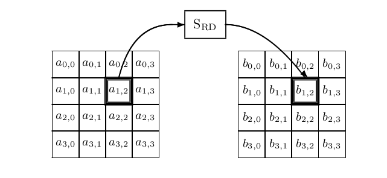
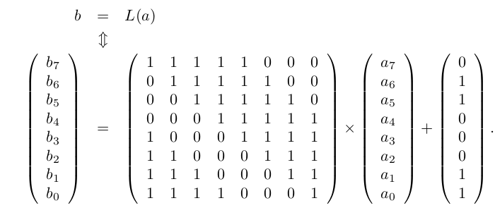
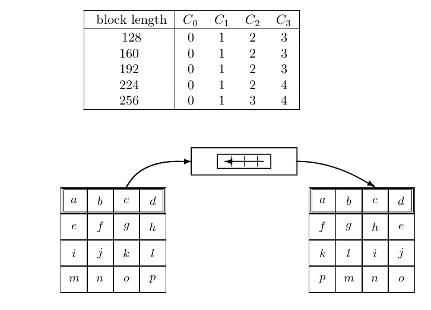

# Advanced Encryption Standard

AES is the Advanced Encryption Standard. It is a [block cipher](block.md) and the successor of DES. AES is the standardized name but the cipher behind AES is Rijndael made by Joan Daemen (who teaches at Nijmegen woahh) and Vincent Rijmen. Its like a concat of their names. AES is still secure to this day after a lot of public scrutiny. 

The main design principle underlying Rijndael are the following:
- **Simplicity** Do not add complexity unless there is a demonstrated need for it. The aim is to have a design that is secure against known attacks, without introducing new vulnerabilities.
- **Modularity** Compose the design of different building blocks, or steps, each with its own dedicated purpose. Select building blocks according to specific quantitative selection criteria.
- **Symmetry** Assure most steps can be parallelized and act in a symmetrical way on the input. The large degree of parallelism allows to trade off area for speed in a flexible way in hardware implementations.
- **Hygiene** Specify all steps in terms of operations in the same algebraic structure and assure they have relatively simple algebraic expressions. In particular, avoid mixing operations such as modular addition and bitwise addition.

## Wide tail strategy 
An important factor in the design of Rijndael is the wide trail strategy. This strategy defines diffusion and non-linearity criteria for the building blocks of the cipher to provide high resistance against differential and linear cryptanalysis in an efficient way. 

Wide trail ciphers differ from [SPN](spn.md) ciphers by the presence of a dedicated **mixing layer**. In an SPN cipher a single substitution layer should introduce both non-linearity and mixing. This results in conflicting requirements for the [s-boxes](spn.md) with compromises. In a wide trail cipher this conflict is absent as it has a dedicated layer for non-linearity and a dedicated layer for mixing. This results in clarity and in many cases in better overall performance.

# Structure 

The encryption with Rijmdeal is done by first performing an initial key addition step with the name `AddRoundKey`. After this there are $N-1$ `Round` steps. After that there is one final step called `FinalRound` .

```c
Rijndael(State, CipherKey) {
	KeyExpansion(CipherKey, ExpandedKey); 
	AddRoundKey(State, ExpandedKey[0]);
	for (i = 1; i < N_r; i = i + 1) { 
		Round(State,ExpandedKey[i]);
	}
	FinalRound(State,ExpandedKey[N_r]);
}
```

The number of rounds ($N_r$) depends on $N_r = max(N_k , N_b ) + 6$ . Here $N_b$ .

The `AddRoundKey` and `Round` steps both take a **state** and **round key** as input. The round key for round $i$ is denoted by `ExpandedKey[i]`  and thus `ExpandedKey[0]` is the input of the initial key addition. `ExpandedKey` is an array of all the round keys that are needed, one for each round. You create this array (`ExpandedKey`) from the `CipherKey `with the `KeyExpansion` step. As each round key depends on the previous round key you can also create each round key on the fly.

The state is a rectangular array of elements of four rows and $N_b$ columns. 

## The round step

The `Round` step consists of 4 invertible transformation steps in the following order:
1. SubBytes -> The non-linear layer.
2. ShiftRows -> The transposition layer.
3. MixColumns -> The mixing layer.
4. AddRoundKey -> The key layer.   

The `finalRound` step is a bit different and does not have the `MixColums` step. The reason for this is the same as in [DES](des.md) were the swap is removed: Decryption is similar to encryption. 

```
Round(State,ExpandedKey[i]) {
	SubBytes(State);
	ShiftRows(State);
	MixColumns(State);
	AddRoundKey(State,ExpandedKey[i]);
}
```

```
FinalRound(State, ExpandedKey[N_r]) {
	SubBytes(State);
	ShiftRows(State);
	AddRoundKey(State,ExpandedKey[N r ]);
}
```


### SubBytes
This is the only non-linear transformation of the round. It applies an invertible s-box,
called $S_RD$ , to the elements of the state. 



The picture only shows that one block of the state goes through the s-box but all blocks of the state go trough the s-box. The s-box is called $S_{RD}$ .  The same S-box is used for every state. This was done to reduce the cost of hardware implementations. 
The S-box was constructed as the composition of two invertible mappings:
- Multiplicative inverse y ← x^{−1} with y ← 0 if x = 0. This can be expressed as $y ← x 2 −2$ . This mapping apparently has very good non-linearity properties that give, in combination with the other steps of the round function, good resistance against linear and differential cryptanalysis.
- [Affine mapping](https://en.wikipedia.org/wiki/Affine_transformation) : to complicate the algebraic expression without affecting the non-linearity properties. The multiplicative inverse has a relatively simple expression that can be exploited in algebraic attacks. The introduction of this affine mapping should make these kinds of attacks ineffective.

In hardware and software you can implement the s-box as a lookup table with 256 entries. There is also a shortcut available for hardware by exploding the internal structure of the s-box. 

The affine transformation looks like this: 



Apparently the presence of the multiplicative inverse ensures that the S-box has good properties when it comes to offering resistance against the two most important types of [statistical attacks on block ciphers](block.md): 

- Differential cryptanalysis: there are no differentials (∆_p in , ∆_a out ) over the S-box with DP higher than $2^{−6}$ .
- Linear cryptanalysis: there are no input-output correlations (u in , u out ) over the S-box with amplitude higher than $2^{−3}$ .

### ShiftRows
This is a transposition layer that cyclically shifts the rows of the state. Each row has a different offset. In particular, it moves the bytes of each column to 4 different columns. Row 0 is not shifted, row 1 is shifted over $C_1$ bytes, row 2 over $C_2$ bytes and row 3 over $C_3$ bytes in the. The shift offsets $C_2$ and $C_3$ depend on the block length.



### MixCollums
This is a mixing layer that operates on the state column by column. The columns of the state are considered as polynomials over $F_{2^8}$ and multiplied modulo $x^4 + 1$ with a fixed polynomial $c(x) = 03 · x^3 + 01 · x^2 + 01 · x + 02$ . It is this specific polynomial because it is one of the simplest polynomial that has a branch number equal to 5. The branch number is a measure that expresses the diffusion power of a mapping in the context of the wide tail strategy. What does this mean? 

The polynomial $c(x)$ is coprime to $x^4 + 1$ . This means it has an inverse modulo $x^4 + 1$. I think because of the circle in public keys cryptography but I am not sure. The inverse of $c(x)$ is $d(x) = 0B · x^3 + 0D · x^2 + 09 · x + 0E$ .  This is simple and efficient to implement in soft and hardware.

### AddRoundKey
This transformation the state is modified by adding a round key to it. This is done with the XOR operation. The round key length is equal to the block length. 

## Key Schedule 
So how do we get the round key? The key schedule consists of two components: the key extension and the round key selection. 

### KeyExpansion
The expanded key is a rectangular array with four rows of elements in $F_{2^8}$ . The key expansion function depends on the key length: there is a version for keys up to 224 bits and a version for keys longer than 224 bits. In both versions of the key expansion, the first $N_k$ columns of the expanded key are filled with the cipher key. The following columns are computed recursively in terms of previously defined columns. The recursion uses the elements of the previous column, the bytes of the column $N_k$ positions earlier, and round constants $RC[j]$ . The round constants are independent of $N_k$ and defined by $RC[j] = x j−1$ . The recursive key expansion allows on-the-fly computation of round keys on memory-constrained platforms.


AES is used millions of times per day, worldwide. 

# The wide trail strategy
In the context of Rijndael the wide tail strategy means that after four rounds, there are no differential trails with expected differential probability (EDP) above $2^{−150}$ and that there are no linear trails with correlation amplitude above $2^{−75}$ . These claims have proofs. You can see the proof for differential trails in the lecture notes section 3.7.5. The explanation for linear trails is similar, but not the same. 

# Security 
Since its submission to the AES competition in 1998, Rijndael has been cryptanalyzed by the cryptographic community and especially after it won the NIST competition, many academic papers have been published about the AES subset of Rijndael. Despite over 20 years of cryptanalysis, no exploitable weaknesses of AES have been shown. 

There have been the so-called biclique attacks published in 2011 by Bogdanov et. al,. These are meet in the middle attacks which use a lot of sophisticated techniques to speed up exhaustive key search by a factor of 4 by not having to do a full cipher execution per key guess. This is a break of the cipher but it a theoretical attack.

## Cache attacks
A reason that Rijmdael won the AES competition was that it was versatile to implement. One component of that was a T-table idea that allows to execute the `round` function with one table lookup and 32 bit XOR instruction. 

One thing the creators of AES did not think about was the cache of cpu. A few years after the AES standard appeared, it was shown that T-table implementations leaked the key by their computation time. When performing a table-lookup, the offset in the table is the value of a byte in the AES state and this value depends on a byte of a round key. Hence, the computation time of a table-lookup depends on the key. It has been shown that an adversary that can obtain timing information from a process running on the same CPU as the AES T-table code, can finally reconstruct the cipher key.          

One initiative to fix this problem was that of Peter Schwabe and Emilia Käsper to write efficient AES code that does not use table-lookups by using the technique of `bit- slicing`. The other was the initiative of Intel to have dedicated AES instructions on their CPU's.        

## Security strength
So what is the upper security strength bound of AES? More formal what is the upper bound on $Adv^{prp}_{AES} \leq \frac{|Q_c|}{2^{k}}$ that holds for any possible adversary $A$ .   

There is actually one Adversary whose advantage matches this bound this is the one that performs an exhaustive key search with $|Q_c|$ .

So far this claim has been broken but not in a practical way. The biclique attacks only lower the upper bound by a bit and the cache timing attacks also have solutions. It still takes nearly $|Q|$ is still nearly $2^k$ and thus practical attacks are non existent at this moment. 

This means that AES can be used to build other crypto graphic schemes!


