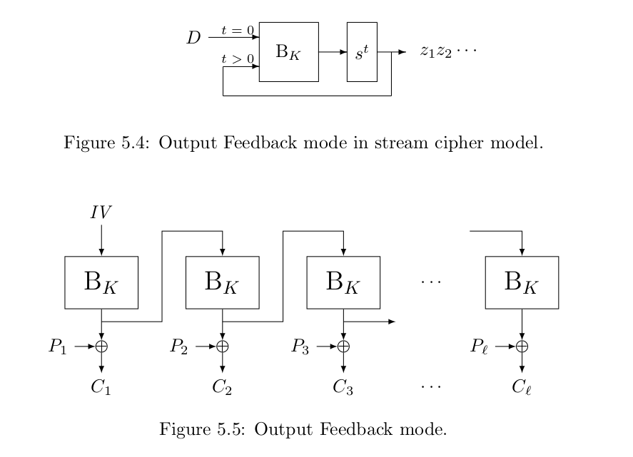
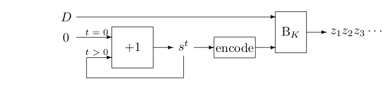

# Block Cipher Modes

There are four different modes one can use with [block ciphers](block.md) to build larger encryption schemes. Sadly only one of these modes is still considered secure.  

## Electronic Codebook mode (ECB)

ECB mode is the most simple mode that can be used to encrypt messages that are longer than $\ell$ bits. 

Suppose the message is $\ell * b$ bits long. If this is not the case we have to add [padding](padding.md) to make this the case. With ECB mode you split a messages into $\ell$ blocks of $b$ bits. Then you run all these blocks trough the block cipher to get the corresponding cipher texts $C_i$. The cipher text $C$ is just the concatenation of all the cipher text blocks e.g. $C = C_1||C_2|| · · · ||C_l$ . To decrypt you just run the inverse of the block cipher $B^{-1}_K(C_i)$ and concatenate the plaintext blocks like $P = P_1||P_2|| · · · ||P_l$ .

### Advantage
Both encryption and decryption can be run in parallel. Each block can be run at the same time. 

### Disadvantage
Each block in of the plaintext that is the same will get the same cipher text. The reason for this is that each block is **independent** from the other blocks. This is a bad thing as with block ciphers you want as many bits of the plain text to have an influence on the cipher text.

This independence of blocks makes ECB mode insecure as you could distinguish a block cipher from [a random permutation](advantage.md) ($P$) in one 2 block cipher query were both blocks are the same. These blocks will have the same output $P_1||P_1 -> C_1||C_1$ . The chance that this happens with $P$ is really really small.

## Cipher Block Chaining Mode (CBC) 
The main issue with ECB mode is that if $P_1 = P_2$ then $C_1 = C_2$ . One way to fix this is by randomizing the input blocks to $B_K$ in some invertible way to ensure that no blocks will be the same. A standardized way to do this is Cipher Block Chaining (CBC). In CBC mode we first apply padding to make the plaintext a multiple of b and then we split P into $\ell$ blocks $P_1, P_2....P_{\ell}$ .  

Then we add (bitwise [xor](xor.md)) some random initial value ($IV$) to the first plain text block. We then encrypt this block to get $C_1$ . We then bitwise XOR this $C_1$ to the next plaintext block $P_2$ after which we encrypt $P_2$ to get $C_2$ . This you continue until you have all the cipher text blocks. The last step is to just concatenate all the blocks.

[Alice](people.md) has to send IV with the cipher to [Bob](people.md)  because Bob needs it to decrypt the message. 

### Non-Parallel Encryption
Because you need the encrypted version of the last plaintext block to encrypt the next plaintext block encrypting with CBC mode is fundamentally non parallel when you encrypt. You can decrypt in parallel however because you just decrypt all the blocks with the key in parallel  and then xor bitwise add each block to the block after it which can also be done in parallel. For the first block you have to add $IV$ to get the plaintext back.  

## Security
For the block cipher to work it has to look random. This will happen if the output of $B_K(P_1)$ is random. For this to happen $B$ has to be a good block cipher and $P_1 + IV$ has  to be random. Thus $IV$ has to be random.  

If these requirements are met things can still go wrong however because of [collisions](colissions.md). If a collision happens in the cipher text blocks will be the same. These collisions leak information about the difference between plaintext blocks because if $C_i = C_j$ then that implies $P_i + C_i −1 = P_j +C_j−1$ and hence $P_i + P_j = C_i−1 + C_j−1$ . As $C_i−1$ and $C_j−1$ are known to the adversary, she learns the value of $P_i + P_j$ . This is similar to what happens when you re-use a key with [One Time Path](otp.md) encryption. 

## Getting an IV
Getting an IV leads to problems when people implement this because it requires a decent random generator and people have to not shoot themselves in the foot. But now block ciphers require a random $IV$ while [stream ciphers](stream.md) only require a unique [D](letters.md). One way to "solve" this is by requiring a unique $D$ and create $IV$ based by doing $IV = B_K(D)$ . Instead of sending the IV we send the $D$ . Now a block cipher reaches the same security as a stream cipher. 

This is disappointing as the promise of block ciphers was to remove the need for diversifiers.  

Block ciphers have failed to deliver their promise. We can still use them to build stream ciphers because we did get nice block cipher implementations especially AES. AES is used in different places as a building block but for encryption we can use AES to build a stream cipher.  

### Advantages of stream encryption
An advantage of stream ciphers is that we only need to add the keystream (Z) to the plaintext (P) which removes the need for a reverse operation like block encryption needs.  We also don't have to do padding because we can just truncate the output of the blocks whenever we want if we have enough Z. 

This brings us to stream cipher modes of use. 

## Output feedback mode (OFB)
This is an example of what not to do. 

In OFB mode we take an IV to start with. This IV is then encrypted with the $B_K$ and then added to the plaintext to get the first part of the cipher text. If more keystream is needed we take the output of the previous block ($B_K(IV)$) and run it trough $B_K$ again to get the next block of keystream. This block is then again added to the relevant part of the plaintext to get the next cipher text block. This continues like this until enough keystream is generated. The important thing here is that we use the output of the previous block as input for the next block to get a keystream. 

A stream cipher has a D so that we can use the same key for multiple encryptions and decryptions. We would like to get IV from D. We can't just say IV = D because then you could distinguish the stream cipher from a RO in 2 queries like this:
1. You first query two blocks of plaintext and get the resulting Z blocks ($z_1$ and $z_2$). 
2. Then you query the first block of Z which will result in the second cipher text block you get previously because the the same D is used so the same D = IV + the $z_1$ gives you $z_2$ because $B_K((z_1+D))$ is also how we made $z_2$ earlier. 

A solution for this is to say ok we make |D| r bits shorter than b and then add 0 to make the D b long again. This works because it is unlikely that $z_1$ will have the last $b-r$ bits zero but this also decreases security as there are less D possible.

### Cycles

Another reason why this method is bad is that there are only $2^b$ possible blocks possible. Thus if the message is longer than $2^b$ blocks then the blocks will start to repeat and we are back at the EBC mode problem. However because we are using block ciphers which are like a like a random permutation is it basically impossible to predict when the repeating will start to happen and how long these cycles are. It is unlikely however that the initial state is a short cycle. Cycles are a way to distinguish a stream cypher of this kind from a random oracle but it requires a very large data complexity. 

### Non periodic stream

When generating a keystream that is not periodic, all state values are different s t implying that all keystream blocks z t are different. This is not necessarily the case for a random oracle, that will exhibit collisions between b-bit blocks in its output stream. This limits the maximum security strength of OFB mode to b/2 (birthday bound).

OFB mode is inherently serial. Both encryption and decryption. 

 

## Counter mode (CTR) 
A more suitable block cipher mode is Counter mode (CTR). In counter mode, the block cipher takes the place of the output function and the state-updating function is a simple counter. The state consists of two parts: the block cipher key K that is fixed, the rolling state $s_t$ that has length $r < b$ , where $b$ is the block length of the block cipher $B$, and a diversifier $D$ of length $b − r$ . We have: $z_t = B_K(D || encoded_r (s^t ))$ and $s^{t+1} = s^t + 1$  . The initialization consists in writing the key K and setting the initial state to 0: $s_0 = 0$ .         

So the idea is you pick a D but you make this D r bits shorter than b. Then you make the D as long as b by appending r bits. The r bits in counter mode is just a counter that starts with 0 and you keep increasing. You have to encode this counter somehow to binary format and it should be as long as r. So if the counter is 0 you do need r 0s.    

What makes counter mode better is that you know when the cycle will repeat namely after 2^b block evaluations which is the best you can get.

The key stream length is restricted to $2^{b−r}$

Counter mode can be run in parallel.

The security of counter mode is limited by a similar effect than OFB mode. When generating a keystream, all state values are different s t ’s, implying that all keystream blocks z t are different. This is not necessarily the case for a random oracle, that will exhibit collisions between b-bit blocks in its output stream. This limits the maximum security strength of OFB mode to b/2 [birthday bound](bdaybound.md).

# Comparison 
Here is a comparison of the modes. The modes are compared on the following criteria:

- Parallel encryption: specifies whether plaintext blocks can be encrypted in parallel or not;
- Parallel decryption: specifies whether ciphertext blocks can be decrypted in parallel or not. If so, this implies that one can separately decipher blocks of the ciphertext, wherever their position. This is usually called random access to the ciphertext.
- Inverse freeness: specifies whether the inverse block cipher $B^{−1}_K$ is required;
- Absence of message expansion: whether the message must be padded or not before encryption;
- Tolerant to bit flips in ciphertext: whether bit flips in the ciphertext (e.g., due to a noisy
communication channel) stay confined to the same bits in the plaintext after decryption;
- Graceful degradation in case of nonce violation: if a user uses twice the same value for the diversifier, does this lead to serious leakage about the plaintext?

| Criteria                                |ECB|CBC|OFB|CTR|
|-----------------------------------------|---|---|---|---|
| Parallel encryption 					  | x |   |   | x |
| parallel decryption 					  | x | x |   | x |	
| inverse free							  |   |   | x |	x |
| absence of message expansion			  |   |   | x | x |
| tolerant to bit flips in C → P		  |   |   | x | x |
| graceful degradation if nonce violation |n/a| x |   |   |

You can prove that counter mode based on AES is secure (if we assume AES is secure) you can see this proof in the lecture notes. You have to believe that AES makes a valid claim. 

