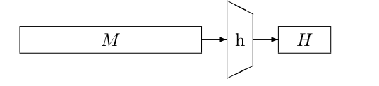

# What is a cryptographic Hash function?

 A hash function h is a primitive that takes as input an arbitrary-length string and returns an n-bit digest H (also known as the hash result or sometimes just even hash), with n some fixed length: $h(M) = H$ .       
 
 
 
In programming there are many use cases for hash functions. In most of these use cases, one hopes that the digest for different inputs look unrelated.

Examples of cryptographic hash functions include: [Hash implementations](hashimplementations.md)

# Requirements 
These are the classic security requirements for hash functions.

## Collision Resistance
We want the results of a hash function to be unique. This way software can rely on the hash function to generate unique identifiers. This way you can also prove that one file is the same as another file because for each hash there should only be one file.  Thus it is important that no two different inputs map to the same digest.  

There are non cryptographic use cases for this and also cryptographic use cases. For instance you could sign a document by publishing the hash of your private key concat the document for a unique hash this could be a signature. 

In more detail, we call a hash function collision resistant if it is infeasible to find distinct messages $M_1 \neq M_2$ with the same digest $h_{M_1} = h_{M_2}$ .

Because the there is an infinite amount of inputs there also exists an infinite amount of collisions however it should be computationally hard to find a collision. 

For a random oracle, we can exactly quantify how hard it is by expressing the success probability of finding a collision as a function of the number of random oracle calls, that we will denote by $|Q_c|$ . As the output of a random oracle is unpredictable, the best an adversary can do is try different inputs until a collision is found. After computing the digest for $|Q_c|$ messages, we have obtained $\frac{|Q|}{2}$ pairs of messages. The collision probability is simply determined by the birthday bound in the digest length n. This probability becomes close to 1 if $|Q_c|$ gets close to $2^{n/2}$ . It follows that for a hash function the best possible collision resistance security strength that can be achieved is n/2.

## Second pre-image resistance
Second pre-image resistance is about finding a message that has the same hash as some other message. This is harder then just finding a collision. With a collision you just need to find messages that have the same hash. With second pre image resistance you already have a (M,H) pair and you have to find another M' that hashes to the same H.  

In more detail, we call a hash function second pre-image resistant if it is infeasible, given a message M, to find another message M' that has the same hash. Or $h(M') = h(M)$.

For a random oracle, the success probability of finding a second pre-image after $|Q_c|$ attempts is close to $|Q_c|/2^n$ . The expected cost of finding a second pre-image is hence about $2^n$ , so the second pre-image resistance security strength of any hash function is at most n. 

Second pre-image is just a special case of a collisions, but for a secure hash function it is much harder to achieve.

## Pre-image resistance
(first) pre-image resistance is the resistance of a function h against the ability to reverse a H. So you given some H you are able to find a M input that results in the H. This is harder than second pre-image.   

We call a hash function (first) pre-image resistant if it is infeasible, given a digest H, to find a message M that hashes to H, or $h(M ) = H$.

For a random oracle, the success probability of finding a pre-image after $|Q_c|$ attempts is close to $|Q_c|/2^n$ . The expected cost of finding a pre-image is hence also about $2^n$ , so the pre-image resistance security strength of any hash function is at most n.

## Keyed hashing
You can build [MAC](mac.md) and [Stream ciphers](stream.md) from hash functions. 

# Security of hash functions
Inspired by Chapter 4, one might be tempted to model hash function security by bounding the
advantage of an adversary A in distinguishing h from a random oracle RO:

$Adv^{ind}_h(A) = ∆_A(h ; RO)$ .

This does not work. The reason for this is that in one of the two oracles in, no randomness is involved. This is caused by that there is no key. 

More detailed, adversary A has access to either the hash function h (a mathematical function with a specification), or a random oracle (which is an abstract object without a specification). What this concretely means is that A can evaluate h offline on its own computer (because of the [kerckhoff principle](kerckhoff.md), and it can check if the outcomes match the responses from the oracle. If this is the case, it is conversing with h; if not, it is conversing with RO. So lesson one is that we must have to find some way to incorporate randomness in the “real world”. 

One way to do so is to consider an abstracted version of the hash function, where a certain atomic building block is idealized. This way, h is viewed as a mode M that operates on top of a primitive F. For example, M is the Merkle-Damgård construction and F is a compression function, or M is a sponge construction and F is a permutation. 
Then, the atomic building block F is idealized. This means that it is viewed as a random primitive. It results in the distinguishing game of Figure 8.13.

By idealizing the primitive of a hash function we can not actually prove the security of a hash function. The only thing we can achieve is proving that an idealized version of it, with the underlying primitive being idealized, is a secure hash function.

However A is and should be able to query F. Because of kerckhoff. By symmetrical reasons, this means that the adversary must also be able to query F in the ideal world. 

This leads to defining hash function security by bounding the advantage of an adversary A in distinguishing a hashing mode M based on ideal primitive F from a random oracle RO 

$Adv^{ind}_M (A) = ∆_A(M, F ; RO, F)$ .

It looks like this:

![[8.14.png]]

Unfortunately, this model does not work either. Any mode M can be distinguished from RO in only a few queries. The adversary queries the mode M with some chosen message M , and then simulates the mode by making calls to F as described by the mode. In the real world, the outcomes will match; in the ideal world, they will very likely not match.       

This problem did not happen with stream ciphers and block ciphers because there there is a secret key that the A just doesn't have. 

## Differentiating advantage
So how do we fix this?

The model we are after at is that of “differentiating adversaries” of Maurer et al. This model replaces the function F in the ideal world by a simulator S. See also Figure 8.15. 

This simulator gets access to the random oracle RO, and its goal is to give outputs that are consistent with the random oracle. Indeed, in the real world (M, F) there is some relation among the queries and the adversary may actually “recompute” outcomes from oracle M with its oracle F. **The goal of the simulator is that if the adversary would “recompute” outcomes from RO, these actually match with the outcomes of S.**

It is yet unclear how such a simulator actually looks like. The answer is, that it is specific to the
mode: one develops a simulator S such that, hopefully, outcomes of (M, F) are hard to distinguish
from (RO, S). Security bounds can then be proven for a given simulator S.

We end up with the following definition of differentiating advantage:
Let M be a hashing mode based on random primitive F. Let RO be a random oracle and S be a simulator. The advantage of an adversary A in differentiating (M, F) from a (RO, S) is defined as 

$Adv^{} iff}_M(A) = ∆_A(M, F ; RO, S)$ . 