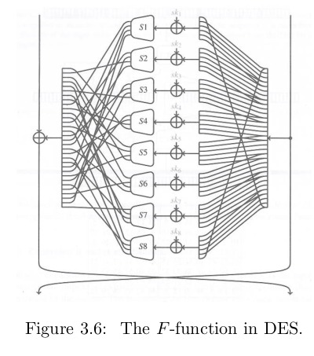

DES (Data Encryption Standart) is a [block cipher](block.md) made by the National Institute for Standardization and Technology (NIST). People wanted a way to encrypt their data. 

Des has a data path and a key schedule. This is the general structure of block ciphers. 

Data goes through a round of s and p boxes and then the key does something with it. The key itself also goes through rounds of presumably s and p boxes or something similiar. This structure of having 2 paths and letting the 2 paths influence eachother in this way is called a Feistal structure.

# DES internals

As most [block ciphers](block.md) des has two main parts: A data path and key schedule. 

The data path of DES consists of the repeated application oaf a round function that takes a round key. The key schedule generates these round keys from the cipher key.

## Data path

First the data is split into left L and right R. 

R is send forward but also goes trough a function F. F takes a round key (produced by the key schedule) and the R bits. The result of this is xor added to L. This is called an F step.  

Then R and L are swapped. This is called the swap step. 

It looks like this: 

[Feistal structure of des](feistal.jpeg)

DES has 16 F steps and 15 swap steps. We don't swap in the last round because this would just be wastefull as no more F steps are coming. I assume the F step contains s and p boxes.  The only difference between DES and inverse DES is the order of the round keys. DES starts with $RK_1$ and ends with $RK_16$. The inverse of DES ends with $RK_1$ and starts with $RK_16$ . There are also an initial permutation and final permutation steps but these don't add any cryptographic security. 

The function F worked like this:

### Expansion
The 32 input bits are expanded to a 48 bit string by duplicating the bits in some positions.

### Round key addition
A 48 round key is bitwise added to the a bit string.

### Substitution 
The 48 bit string is split in 8 blocks of 6 bits and each of the bits an s-box is applied. These S-boxes have a 4-bit output and are all different. 

### Permutation 
The resulting 32 bits undergo a bit transposition. 

## Key schedule

Officially DES uses 64 bit keys but 8 bits of the key are thrown away. This leaves 56 bits. These 56 bits are then divided in two 28 bit groups left and  right. Each round these two halves:

- are cyclically shifted over one or two positions (<<<) The number of positions depends on the round number
- From each half, permuted choice 2 (PC2) selects 24 bits. 

These 48 bits form the round key that is applied in the F function of the current round.

As PC1 and PC2 are just selecting bits from their input, every round key bit can be traced back to a particular bit of the cipher key.

# Structural Weaknesses in DES

## Weak keys 

If you have a key of all zeros then each round keys is also 48 zeros. The same with if the first 56 bits of the key were ones then all the round keys would be ones as well. These types of keys are called weak keys. Using a weak key means that with these two keys there is no difference between encrypting and decrypting because the only difference is the order in which the round keys are applied. But if the round keys are the same every round then the order does not matter. This means that to decrypt a text that was encrypted with a key like this you can decrypt it again by just encrypting it again. 
This is not a property that random permutations have and thus it can be exploited to differentiate DES from a random permutation. If you encrypt something and then you encrypt it again and the original plaintext comes back you know that the key is all 0 or all 1. So if you use a key of all 0 or all 1 you can find the key with at most 4 queries. 

## Complemtation property.

The operation of complementing is flipping all the bits in a message. All 0 go to 1 and 1 go to 0. You get this result if you do a bitwise addition of an all 1 bit string. You write this with \overline in latex. Like so $\overline{X}$ . The complementation of X is $\overline{X}$ . 

It turns out that if you have P and K and $\overline{P}$ and $\overline{K}$ you get the same result in the F function.

$P = 0010$ \
$RK = 1010$ \
$P + RK = 1000$ \

$\overline{P} = 1101$ \
$\overline{RK} = 0101$ \
$\overline{P} + \overline{RK} = 1000$ \

So the output of F is the same. 

But this same output is then added to L and $\overline{L}. This happens every round. At the end you get C and $\overline{C}$ . 

# Double DES 

DES has a 56-bit cipher key this means that on average you have to try half of all the keys to get the right key which is $2^{55}$ . With the compelation propererty you only have to try half the keys which comes out to $2^{54}$ keys. In 1997, it took 10.000 workstations that could do 500.000 trials per second to crack the DES challenge by RSA labs in 2,5 months. That is not not long at all.

Because of Moore this would today with around 10000 euro take less then a Day. Thus a DES had to be improved.

The first suggestion was just applying DES twice (double-DES) with 2 independent keys but you can do a meet in the middle attack on this which causes the security of double DES to be only 56 bits. In practice this is enough to offer protection against everyone except state actors and the likes of Google. 

## Meet in the middle attack

**Online:** get some C from a couple different P from the online double DES.

**Offline:** Build two tables of 2 collums. The first table that has values ($K_i$ and A) where A is $DES_{K_i}$ for all possible 2^56 possible keys. Now do the same for the second table but now with the corresponding C so you have ($K_i$, $DES_{K_i}(C)$). Then search for all the collisions between the table.  There should be around \frac{2^{2*56}}{2^{64}} = 2^{48} collisions. *.  

In practice this takes more then 2^{57} attempts as you have to probably sort the tables also make the tables which will be around 2 milion TB big. 

You could also build only one table and check each entry of the second table to the enteries in the A table and then you immidiatly check each collision with the second plaintext and cipher text pair. This way you only have to store one table but you still have to do the same amount of calculations. 

# Triple DES

A simple improvement over double DES avoiding the above meet in the middle attack is Triple-DES. Tripple-DES takes a 168 bit key. This 168 bit key is divided over $k1$ $k2$ and $k3$. 

Triple DES still allows a meet in the middle attack but it now takes $2^{112}$ bits. With triple DES you first apply DES with k1 then you do the inverse DES with k2 and then DES again with k3. With reverse triple DES you first do inverse DES then DES and then inverse DES again. The 168 key should be chosen in such a way that all k1, k2 and k3 are all different. This is the variation of DES that NIST endorses. 

You can also choose k1 = k3 and k2. This reduces the security to 80 bits but banks still use it. 
You can also choose k1 = k2 = k3. This is the same as having just 1 DES because if you do this the DES and inverse DES cancel each other out. People make this choice for backwards competability. Better would have been just having 3 DES and then using weak keys for k1 and k2 to get backwards competability this would also reduce to just one DES.  

After 20 years a competition was launched by NIST for the succesor of DES the Advanced Encryption Standard or [AES](aes.md).

