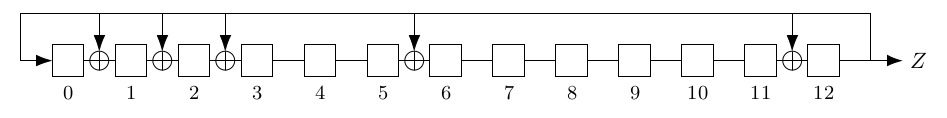
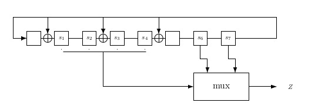

# LFSR

To combat the issues with [otp encryption](otp.md) they came up with lfsr machines. An lfsr machine is a machine that takes a short key as input and then produces an arbitrary long stream of bits called the keystream or S. You can then just take from this keystream the number of bits you need to encrypt this message. This whole technique is called a stream cipher. 

This sounds great! Now we only need short keys (seeds for the lfsr) but sadly not. lfsr stands for LINEAR feedback shift registers. The fact that these machines are linear makes them predictable. 

The machines look like this:

 

The machine produces one output bit at the time and then shifts everything.

# Problems

You can actually get the initial state if you have enough output bits by simply working back from it. If you have the output bits then you have the bit at the last position for all the states you have the output bit. Because it is linear you can even just do a matrix multiplication to work back and then it becomes super easy.

The matrix is like: 
- Identity row but one lower this moves everything forward.
- On the side only have ones if there is a TAP otherwise have a 0 the first on the side is always a one because the last has to move back. 
- The lfsr questions on the exam don't involve the matrix. 

So then they made lfsr that take takes breaks when giving output bits. This doesn't work because you can still just make a matrix but it is just harder. You just apply the matrix more times before you take the output bits... Because of the [[kerckhoff]] principle you can't hide your design either.

# Solutions

Linear lfsr do not work. **It looks like any linear cipher does not work!** We have to add some non-linear function. 

## Multiplexer 

A way to do this is with a multiplexer. The idea is that you give many options to the multiplexer and use another bit or set of bits to choose the output bit. 

It looks like this: 

### Guess and determine attack
By making the output bit come from only a couple of the state bits we can do this attack. 

1. Just **guess** the state of the mux = multiplexer.
2. **Determine** what the output bit must have been. 
3. Go back to step 1 unless you have an inconstancy with the output bits you have.
4. If there is an inconstancy go back to the guess that caused it and guess again. 

Like this you can actually get the lfsr initial state in around 40 guesses. If you have the initial state you can get any state. 

## Combiner lfsr

The idea of combiner lfsrs is to just combine the outputs of 2 lfsr together in some non linear way to get the final output. A possible way to combine them would be with modulo. Sadly you can still divide an conquer attack this. For instance you could guess the state of the shorter lfsr and that will give you a lot of information about the longer lfsr should be. If you think you have a possible state then just generate more bits and see if they match what you have.   

The upper bound security of combiner lfsr lies in the length of the shortest of the two lfsrs. Also you always have to do a little more work then just guessing you also have to do the modulo etc.  

## Diversifier

The problems with lfsrs can be resolved by giving an additional input: a *Diversifer D* The goal of D is to generate multiple keystream sequences from the same Key. In this case we call the initial value the key. Namely, running the stream cipher with different values (K,D) gives different keystreams Z. D is send with the message so that Bob can use it aswell to get the same result. This way Alice and Bob can keep using the same keys.  

The idea of a diversifier is that you can make multiple keystreams from one key by using an additional input D for divisifier. This diversifier can't repeat however because that means using the same keystream twice and that is not good as you can see in the start of the book.

$M + S = C$ \
$M' + S = C'$ \
$C + C' = M + S + M' + S = M + M'$ \

This gives us the difference between the two messages and leaks information. 

You can just take an email adress or ip adress as your base diversifier and then keep counting. Important is that you send the diversifier with the message. However this does often go wrong. When this happens it is called nonce misuse. 

