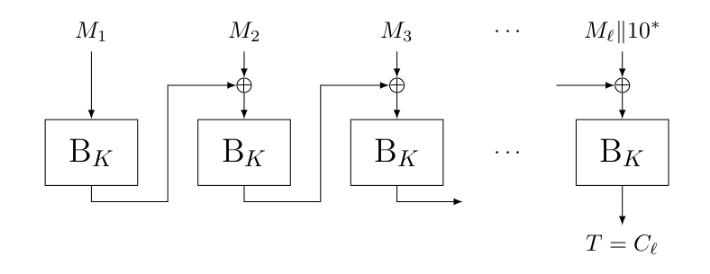
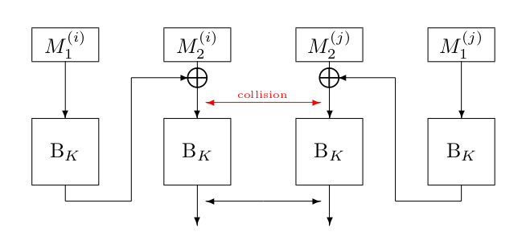

# Message Authentication Function

Encryption does not offer [data integrity](goals.md) and it was never meant to. Change a bit blabla. If you want that then you have to compute a cryptographic checksum and send it with the message. Then when Bob decrypts the message he can verify that it is the message that Alice actually send if the checksum is correct. These checksum are called a **tag** and are made with a **mac**. 

The mac takes an arbitrary length message and computes a result that should look unique of length $\ell$. 

A [wide block cipher](block.md) would be able to deliver both integrity and confidentiality. 

MAC functions require a key. 

The process of verifying a tag is formalized with the YFY function. It takes a secret key and a message of arbitrary length and a $\ell$ bit tag. It verifies if $MAC(K,M) == T$  and it outputs OK/NOK accordingly. 

# Mac security
The main security goal of a MAC function is that it is infeasible to forge a message and its tag for an adversary does not know the key K. This also means that a having a lot of message and tag pairs should not give Eve any way to forge the tag of another message.

A forgery is when by another M and TAG pair you can create the TAG of another (specific) message. 

The advantage of an adversary A in mounting a forgery
against MAC K is defined as

$ADV^{unf}_{MAC_K}(A) = Pr (A^{MAC_K, VFY_K}$ ever gets OK from $VFY_K$.

Here is is not allowed to make a forgery attempt for a message-tag pair that has already been received form $MAC_K$.

Good PRF is a good MAC.

# Universal hash based MACs
The earliest constructions of MAC functions used a so-called universal hash function, a function with cryptographically lighter security properties than a MAC function. This universal hash function is used to process the message, and only then a cryptographically strong primitive is used to generate the tag.

Most universal hash functions are easy to forge! Their security is not measured by unforgability but by the probability (taken over the random drawing of the key) that one finds certain types of collisions or preimages.        

Preimages is when you know what the hash of something is going to be before you compute the hash function. Collision if you have 2 inputs that give the same hash.

More detailed, for a universal hash function h we will use the notions of δ-universality and ε-XOR- universality as defined below. The function h is considered a good universal hash function if its δ and/or ε are “low,” i.e., close to $1/2^k$ for key size k. 

We denote hash functions with h. 

## δ 
A hash function h that takes a key is δ-universal if for all messages M and output values T, and randomly drawn K from the set of all keys: $Pr(h_K(<) = T) <  δ$ . This means a h is  δ universal if the chance is small that the hash for the message is itself. 

## ε
It is called ε-XOR-universal if for all distinct messages M, M' and output values T , and randomly drawn K from the set of all keys, $Pr(h_K(M) ⊕ h_K(M') = T) ≤ ε$ . This means that the chance that the hash of a message xor the hash of another message is the same as the TAG as one of those messages or the tag of another message.  

# CBC MAC
We can build a MAC function from the CBC mode of Chapter 5. In CBC a ciphertext block C depends on all message blocks up to $M_i$ . The idea of CBC-MAC is to use CBC encryption with IV = 0 and **take the tag equal to the last ciphertext block** , while at the same time throwing out the previous ciphertext blocks. The latter is important as failing to do this makes the MAC function easy to distinguish from a random oracle.      

The key is needed for the block cipher behind the MAC. 

## Security for fixed length messages 

A CBC MAC can be proven PRF secure if applied only to messages of the same length.

CBC-MAC can be proven PRF secure if applied only to messages of the same length. Intuitively, if we consider any two distinct messages of the same length, they must have a “first message block” that is different. Two different but similar messages are the same until they arn't.  After this difference the messages and what goes in the blocks are independent. That first message block, say it is the i-th one, will incur a difference in the input to the i-th block cipher call. This difference makes any subsequent block cipher evaluations mutually independent as long as there will never be an input collision to any two block cipher calls.

So it is secure unless there is a collision with two blocks and the XOR. This reveals an exposition of the birthday paradox, namely that one cannot get a better security bound than $(\frac{|Q_d|}{2})/2^n$) . For a random oracle there is no thing as input collisions; it outputs random strings for any query. 

In fact, one can also distinguish CBC-MAC from a random oracle in computational complexity around $2^{n/2}$ 
- Query multiple 2-block inputs $M_(i)$ of the form $M_1||M_2$ , such that both the M 1 ’s and the M 2 ’s are distinct for all queries $M^{(i)}$ 
- If we have a collision $B_K (M_1) + M_2 = B_K(M_1) + M_2$ , then we have colliding tags. If we have that we know we are talking to the CBC mac.

Note that an attacker may, indeed, find a desired collision in the birthday bound, i.e., in data complexity $|Q_d| ≈ 2^{n/2}$ . 

## CBC-MAC for arbitrary-length messages
Sadly CBC-MAC is weak for arbitrary length messages. we can distinguish it from a random oracle in two queries. If we query $M_1$ , then we get $T = B_K(M_1)$. For the second query, we apply $M_1 || M_2$ with $M_2 = M_1 ⊕ T$.  So the second message concated after $M_1$ is $M_1$ XORed with its TAG. In short qeury2 = $M_1||M_1 ⊕ T$

Then the resulting tag will be:

$B_K(M_2 ⊕ B_K (M_1)) =$ \
$B_K(M_1 ⊕ T ⊕ B_K (M_1)) =$ \ 
$B_K(M_1 ⊕ T ⊕ T) =$ \ 
$B_K (M_1) = T$ 

In the second step $M_2$ turns into $M_1 ⊕ T$ .

This means we can construct 2 messages with the same tag super easy. The random oracle would give two unrelated tags.  

![[leattack.png]]

This weakness is sometimes called the **length extension weakness**.

The attack as displayed here does not take into account that messages should be padded, but this can be accounted for. One could also truncate the tag, to have it be only the first so many bits of $C_n$ (the last ciphertext block). This helps, but the security strength can be increased to at most $b/2$.       

# C-MAC
The fix for the length extension is to do something different at the end of the computation. This became the C-MAC function that was standardized by NIST. 

## Simplified construction

C-MAC is defined as CBC-MAC, with one difference at the end: C-MAC adds some subkey *K'* right before the last application of $B_K$. The trick resolves the attack with variable-length messages. The reason for this is that the “last input” in each MAC computation is blinded. This means that this last input cannot be determined by the adversary anymore, and the attack fails.

![[simplecmac.png]]

Note, however, that the construction still achieves [birthday-bound](bdaybound.md) security at best but now you have to find a collision.

# C-MAC NIST standard

The simplified construction of above is close to a NIST standard, but not quite. Note that if this construction is evaluated on a message M of length exactly a multiple of b bits, one must pad it with $10^{b−1}$. This means that the last evaluation of $B_K$ only processes padding bits. Some might say that this is a waste of resources: if it has to process padding bits only, why do you need it in the first place? Because of this, NIST finds it necessary to do some kind of “domain separation” between the case where the message is of size exactly a multiple of b bits, and the case where it is not.         

![[realcmak.png]]

# Problems 
If one wants to achieve both confidentiality and authenticity of a plaintext P , a naive solution would be to simply encrypt P to obtain a ciphertext C and authenticate P to obtain a tag T. 

It is not as simple as this  as the MAC function might not have been made with confidentiality in mind and only confidentiality.  $MAC'_K (M ) = M||MAC_K(M)$ might be a secure MAC function but it does reveal the entire message. 

Having one scheme that achieves confidentiality and authenticity at the same time would be great and more efficient. For this we have [Authenticated encryption schemes (AE)](ae.md)