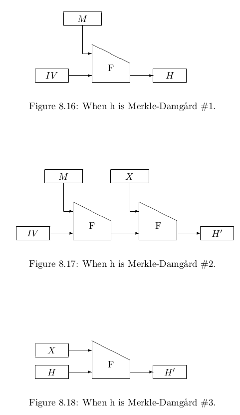
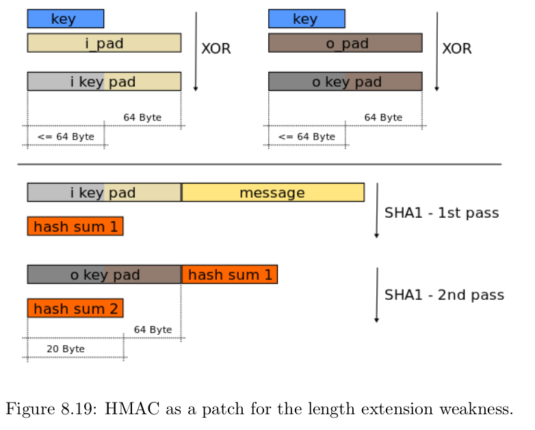

# Implementation of h
In his 1979 PhD thesis, Merkle suggested an algorithm for [h](cryptographichash.md) by building it from a fixed input length compression function, denoted as F.

## Definition
It looks like this:

![[mdconstruction.png]]

The construction pads M injectifly to a string of length a multiple of r, splits it into a sequence of r-bit blocks $M_i$ and iteratively absorbs them into an n-bit chaining value CV.

$CV_i \leftarrow F(CV_{i-1})||M_i)$

For absorbing the first block $M_1$ the construction requires that $CV_0$ is a fixed value called initial value IV. This value was not fixed originally but then it becomes easy to do a second preimage attack even if F is really strong. This means that a collision in h implies a collision in F.  

This is the attack: For any evaluation $h(M) = H$ , one can remove the first block and set IV to be the first CV of the original computation.

# Internal collisions
In this section we will discuss a property of the Merkle-Damgård mode that is in fact shared by all iterated hashing modes that operate on a chaining value of finite size. The limitation to the security that an iterative hash function can offer is internal collisions. 

Suppose that one finds two different strings M, M' such that the chaining values $CV$ , $CV'$ after hashing the strings are equal: $CV = CV'$ . Then, for any bit string X, the messages $M||X$ and $M'||X$ yield the same hash result. The reason for this is that after processing of M and M' , the resulting chaining values are equal, and as the subsequent message blocks (coming from X) are equal as well, the outputs of the compression function F are equal as well. The situation is depicted in Figure 8.3. 

![[internalcollisionmd.png]]

Hence an inner collision gives rise to an infinite family of colliding message pairs. This does not occur for a random oracle, and hence this property can be used to [distinguish](advantage.md) an iterative hash function from a [random oracle](randomoracle.md). What “distinguishing” means in this context is more subtle than in Chapter 4.

The distinguishing attack would work as follows:
1. Determine some sequence of messages $M^{(i)}$ and a message $X$;
2. Query the oracle (either the hash function h or a random oracle RO) with $|Q_c|$ messages of the form $M^(i)||X$;
3. If there is no collision, then the oracle is most likely the random oracle;
4. Otherwise, determine a new message X' and query $M^(i)||X'$ and $M^{(j)}||X'$  for the collision that was obtained;
5. If the results are equal, then the oracle is most likely the hash function. Otherwise, it is
most likely the random oracle.

The advantage of distinguishing the hash function from a random oracle in this way is approximately $|Q_c|^2 · 2^{-(|CV|+1)}$ .

The bottom line is that one can never get hashing security beyond the birthday bound on the size of the chaining value.

# Weaknesses of the Merkle-Damgård mode

## Second preimages
Generically, one expects that a second [preimage attack](cryptographichash.md) on a hash function can be mounted with complexity $|Q_c|/2^n$, where n is the output size. 
However, in the Merkle-Damgård construction, we have |CV | = n. In 2005, Kelsey and Schneier discovered a way to exploit this, and to obtain a second preimage attack on Merkle-Damgård hash function with a success probability higher than $|Q_c|/2^n$ . 
For example, there exists a second preimage attack of a $2^d$ - block message that takes only about $2^{|CV | −d}$ evaluations of F. 

This is explained also in the Figures 8.4 and 8.5. Suppose that we have the hash H of a message M of 2 d blocks (after [padding](padding.md)). Our goal is to obtain a different M' with the same hash value. First, we select a single block message M' , and compare the result after hashing it (Figure 8.5) with every $CV_i$ in Figure 8.4. If d is very large, then the probability that there is a match is approximately, $2^d/2^n$ , so the expected number of attempts we have to make is $2^{n−d}$ this is just ($x^n/x^m = x^{n-m}$) . If there is a collision between $h(M')$ and chaining value $CV_i$ , one extends $M'$ with the blocks $M_{i+1} , . . . , M_{2^d}$ in order to end up with the same digest as 

$M: h(M) = h(M'||M_{i+1}|| . . .|| M_{2^d} )$ .

![[mdspre.png]]

This attack does not take into account length encoding yet. It can be resolved using a trick that can be found in the literature.   

## Length extension attack
While the second preimage problem of Merkle-Damgård is essentially one of too great expectations, the length extension problem is a fundamental flaw that has given rise to painful fixes, similar to what we witnessed with DES being patched to Triple-DES. The length extension attack relies on the observation that for Merkle-Damgård, the following structural property holds for any arbitrarily long M and r-bit X (with proper padding): 

$h(M||X) = F(h(M)||X)$.

![[Pasted image 20220112190221.png]]

## Reduction of the problem
Back in the old days, the Merkle-Damgård approach was considered sound: it reduced the hard problem of building a collision resistant hash function to an easier problem, namely building a collision resistant fixed-input-length compression function. In practice, nobody ever found a way of building a collision resistant compression function from scratch. They were built as a mode of a block cipher or a cryptographic permutation using constructions that by themselves could be considered sound.

# Merkle-Damgård is easy to differentiate from random
Using the distinguishing method described [here](cryptographichash.md) the length attack allows to differentiate plain Merkle-Damgård from random in three oracle queries.

The distinguisher has access to either (h, F) or (RO, S), and makes the following queries:
1. Determine a message M and X;
2. Query M to the hash oracle, and denote the result by H;
3.  Query M' = M||X to the hash oracle, and denote the result by H' ;
4.  Query H||X to the primitive oracle, and denote the result by Y ; (primitive oracle is offline version)
5.  If Y = H', the oracle is most likely (h, F). Otherwise, it is most likely (RO, S).

In order for the simulator S to fool the distinguisher, it must guess H' correctly. But H' = h(M||X), and the simulator never learns M (it only learns H = h(M)), and it outputs $Y = H'$ with negligible property.  

The crucial property of Merkle-Damgård that is exploited in the attack is that the chaining values
can be obtained by querying the mode while choosing a suitable message. An easy fix for this
weakness is making sure that the CVs can only be obtained from F/S queries. For example,
we could add some finalization to the last message block, as we did when fixing [CBC-MAC](mac.md).

# Message authentication from Merkle-Damgård
Can Merkle Damgård be used to construct a [MAC](mac.md) function? Like so:

$MAC_K (M) = h(K||M)$ 

This does not work for Merkle Damgård because of the length extension attack. Look at the lecture for details. 

## Patch Merkle-Damgård in HMAC mode.

There is a patch for message authentication using Merkle-Damgård: the HMAC mode. Figure below. 

Basically a form of feedforward. 

HMAC uses two passes of the hash computation. First, the secret key is used to derive two keys, an inner key and an outer key. This is done by two distinct constants ipad and opad:

$K_{in} = K ⊕ ipad$,
$K out = K ⊕ opad$

The first pass of the hash produces an internal hash from the inner key and the message: 

$H = h(K_in||M)$ . 

The second pass of the hash produces the output of the HMAC from the outer key and the internal hash: 

$HMAC_K(M) = h(K_{out}||T)$

. 